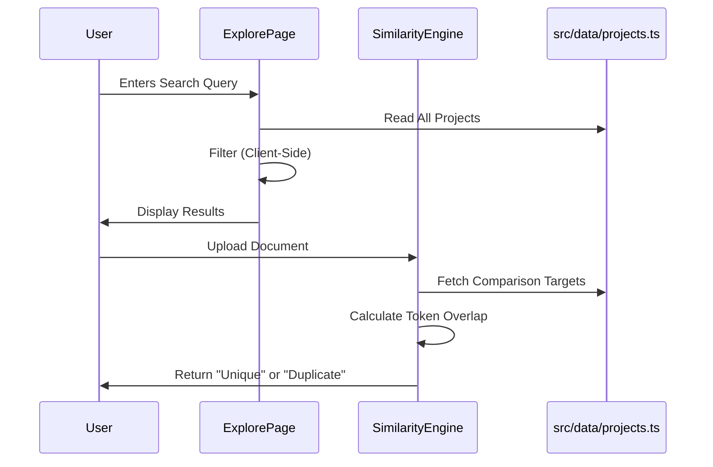

# System DNA Audit: Archive Insight

## 1. Executive Summary
**Archive Insight** is a high-fidelity **Single Page Application (SPA)** built with **Vite, React, and TypeScript**. It functions currently as a **frontend prototype** or **MVP**, featuring a premium "shadcn/ui" design system and simulated core functionalities (Authentication and AI Similarity Detection).

- **Current State**: Client-side only. No active backend integration.
- **Core Value**: Project repository explorer with a simulated AI duplicate checker.
- **Aesthetic**: Modern, "glassmorphic" design using Tailwind CSS and Framer Motion.

---

## 2. Tech Stack & Core Architecture

### **Critical Infrastructure**
| Layer | Technology | Details |
| :--- | :--- | :--- |
| **Runtime/Bundler** | **Vite 5** | High-performance build tool using ES modules. |
| **Framework** | **React 18** | Component-based UI library. |
| **Language** | **TypeScript 5.8** | Strict typing enabled. |
| **Routing** | **React Router DOM v6** | Client-side routing. |
| **State Management** | **React Context** | Used for global Auth state. |
| **Data Fetching** | **TanStack Query v5** | Installed (`QueryClientProvider`), but **unused** in core features. |

### **UI & Design System**
| Category | Stack | Notes |
| :--- | :--- | :--- |
| **Styling Engine** | **Tailwind CSS 3** | Utility-first CSS. |
| **Component Lib** | **shadcn/ui** | Headless Radix UI primitives + Tailwind. |
| **Icons** | **Lucide React** | Consistent icon set. |
| **Motion** | **Framer Motion** | Complex animations (page transitions, modals). |
| **Charts** | **Recharts** | Data visualization (potential usage). |

### **Project Structure (Feature-Sliced-ish)**
```mermaid
graph TD
    src --> components
    src --> contexts
    src --> data
    src --> hooks
    src --> lib
    src --> pages
    
    components --> ui[shadcn/ui primitives]
    components --> features[Feature Components e.g., AIAssistancePanel]
    
    pages --> Auth[Login/Signup]
    pages --> Core[Home, Explore, About]
    
    data --> MockDB[Static JSON Models]
    
    contexts --> AuthCtx[AuthContext (Mock)]
```

---

## 3. Feature & Page Mapping

### **Route Topology**
| Route | Component | Business Logic | State Dependencies |
| :--- | :--- | :--- | :--- |
| `/` | `Home.tsx` | Landing page. | None. |
| `/explore` | `Explore.tsx` | **Core Feature**. Search & Filter projects. | Local State (`searchQuery`, `filters`), Static Data. |
| `/auth/login` | `Login.tsx` | User authentication. | `AuthContext` (Mock). |
| `/auth/signup` | `Signup.tsx` | User registration. | `AuthContext` (Mock). |
| `/about` | `About.tsx` | Static content. | None. |
| `/how-to-use` | `HowToUse.tsx` | Static content/Guide. | None. |

### **Key Features**
1.  **Project Explorer (`Explore.tsx`)**:
    *   **Logic**: Client-side filtering of static `projects` array based on search text, year, branch, and tech stack.
    *   **UI**: Grid/List view toggle, Detail Modal, Responsive Layout.
2.  **AI Similarity Detection (`AIAssistancePanel.tsx`)**:
    *   **Logic**: **Simulated**. Accepts file upload -> "Analyzes" (via `setTimeout`) -> Runs deterministic text matching logic (`similarityEngine.ts`) against static data.
    *   **Engine**: `src/components/ai-assistance/similarityEngine.ts` contains heuristic token matching (e.g., >60% overlap) rather than LLM embeddings.

---

## 4. Data Flow & State Management

### **Source of Truth**
*   **Database**: **None**.
*   **Data Models**: `src/data/projects.ts` serves as the read-only database.
*   **Auth Store**: `localStorage` key `archive_insight_fake_auth` manages session persistence.

### **Data Flow Diagram**


---

## 5. Security & API Layer

### **Authentication**
*   **Mechanism**: `AuthContext.tsx`
*   **Method**: `localStorage` boolean flag.
*   **Security Risk**: **Critical**. No token validation, no password hashing, client-side only. Trivial to bypass. *Acceptable only for checking UI flows.*

### **API Integrations**
*   **Internal**: None.
*   **External**: None.
*   **Middleware**: None.

---

## 6. Pro-Level Analysis & Recommendations

### **Technical Debt & Gaps**
1.  **Mock Logic everywhere**: The "AI" is a heuristic script, and Auth is a boolean flag. These need complete rewrites for a production app.
2.  **Unused Dependencies**: `react-query` is installed but the app currently relies on static imports.
3.  **Heavy Client Load**: `Explore.tsx` loads *all* project data at once. This works for <1000 items but will choke significantly as the dataset grows.

### **Optimization Opportunities**
1.  **Virtualization**: Verify if `Explore.tsx` uses virtualization for the list. If not, add `react-window` for scalability.
2.  **Code Splitting**: Ensure generic UI components (shadcn) aren't bloating the bundle if not used.
3.  **Search Logic**: Move search to a Web Worker or use a dedicated client-side search library (like `fuse.js`) instead of raw `.filter()` and `.includes()` for better fuzzy matching performance.

### **Roadmap to Production**
1.  **Backend**: Connect to Supabase or Firebase.
2.  **Auth**: Replace `AuthContext` mock with Clerk, NextAuth, or Supabase Auth.
3.  **AI**: Replace `similarityEngine.ts` with an API call to OpenAI embeddings or a vector database (Pinecone/Weaviate) for semantic search.
